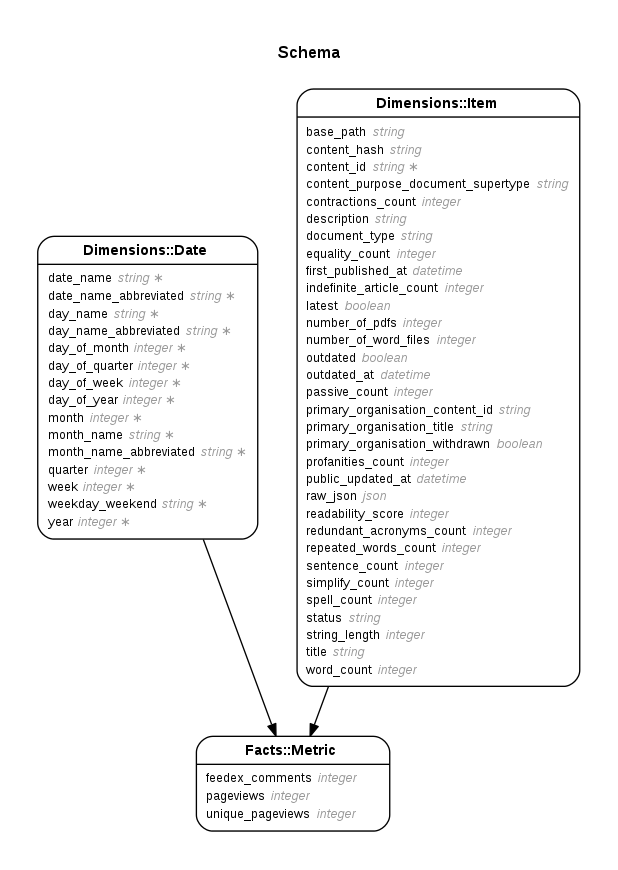

# Content Performance Manager

A data warehouse that stores content and content metrics, to help content owners measure and improve content on GOV.UK.

This repository contains:
- Extract, transform, load (ETL) processes for populating the data warehouse
- An internal tool for exploring the data (AKA the sandbox)
- Content performance API ([docs](content-performance-api.publishing.service.gov.uk/#gov-uk-content-performance-api))

Data is combined from multiple sources, including the [publishing platform](https://github.com/alphagov/publishing-api), user analytics, [user feedback](https://github.com/alphagov/feedback), and [readability indicators](https://github.com/alphagov/govuk-content-quality-metrics).



Regenerate this diagram using `bundle exec erd --filetype=png --connected --title 'Schema' --filename doc/schema`.

## Nomenclature

- **Data warehouse**: the database where we store all the metrics.
- **ETL**: [extract, transform, load](https://en.wikipedia.org/wiki/Extract,_transform,_load) - how we get data into the data warehouse.
- **Fact**: a record containing measurements/metrics
- **Dimension**: a characteristic that provides context for a fact (such as the time it was extracted, or the content item it belongs to)
- **Star schema**: The way we structure data in the data warehouse using fact and dimension tables

## Dependencies
- [GOV.UK Publishing API](https://github.com/alphagov/publishing-api)

## Setting up the application

### Using the GDS development VM

See the [getting started guide](https://docs.publishing.service.gov.uk/getting-started.html) for instructions about setting up and running your development VM.

In the development VM, go to:

```bash
cd /var/govuk/govuk-puppet/development-vm
```

Then run:

 ```bash
 bowl content-performance-manager
 ```

The application can be accessed from:

http://content-performance-manager.dev.gov.uk

## Running the test suite
To run the test suite:
 ```bash
 $ bundle exec rake
 ```

 or you can also use [Guard](https://github.com/guard/guard), see [list commands](https://github.com/guard/guard/wiki/List-of-Guard-Commands)

 ```bash
 $ bundle exec guard
 ```

## Populating data
If you are a GOV.UK developer using the development VM, you can [run the replication script to populate the database](https://docs.publishing.service.gov.uk/manual/get-started.html#7-import-production-data).

To run the ETL process locally, you need to  [set up Google Analytics credentials in development](doc/google_analytics_setup.md).

## Updating the API
### All changes
Anytime you change what the API accepts as input or returns as output, you need to [update the OpenAPI spec and documentation](doc/api/README.md).

### Backwards incompatable changes
Currently the API is in alpha, so users should expect backwards incompatable changes without warning.

When the API is live, we will follow the [GDS API technical and data standards](https://www.gov.uk/guidance/gds-api-technical-and-data-standards#iterate-your-api)
- make backwards compatible changes where possible
- use a version number as part of the URL when making backwards incompatible changes
- make a new endpoint available for significant changes
- provide notices for deprecated endpoints

## Licence

[MIT License](LICENCE)

[docker]: https://www.docker.com/
[docker compose]: https://docs.docker.com/compose/overview/
[GOV.UK replication scripts]: https://docs.publishing.service.gov.uk/manual/replicate-app-data-locally.html
